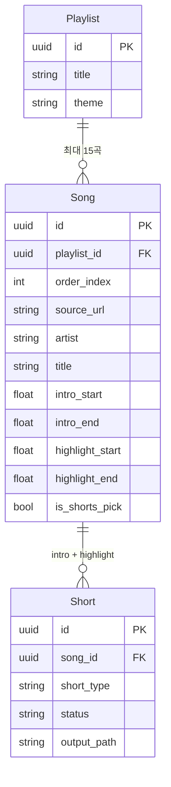
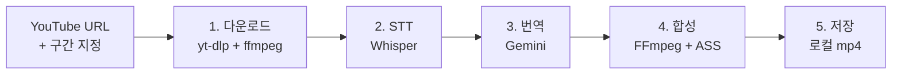

# coolvibeply

> **20-30대를 위한 Pop · R&B · Jazz 플레이리스트 채널 운영 자동화 툴킷**

YouTube 플레이리스트 큐레이션 채널을 운영할 때 가장 손이 많이 가는 작업 — **곡마다 인스타·틱톡·유튜브 숏츠용 짧은 영상을 따로 만드는 일** — 을 자동화하는 로컬 백엔드입니다. 채널 운영자가 곡과 구간을 지정하면, 영문 가사·한국어 번역 자막이 입혀진 9:16 영상을 자동으로 출력합니다.

---

## 채널 콘셉트

- **타겟**: 20-30대
- **장르**: Pop / R&B / Jazz
- **포맷**: 한 영상당 15곡 플레이리스트 큐레이션

### 1회 작업당 산출물 3종

| 플랫폼 | 형식 | 수량 |
|---|---|---|
| YouTube (롱폼) | 15곡 플레이리스트 영상 (메인 콘텐츠) | 1개 |
| Instagram / TikTok | 곡별 intro + highlight 클립 (홍보용) | 곡당 2개 |
| YouTube Shorts | 15곡 중 베스트 1곡의 highlight | 1개 |

---

## 왜 만들었나

곡 하나를 인스타·틱톡·숏츠용으로 다듬는 데 평균 30분~1시간이 걸리는데, 15곡짜리 플레이리스트 한 회차면 하루를 통째로 갈아 넣어야 합니다. 이 도구는 그 반복 작업 — **다운로드 → 받아쓰기 → 번역 → 9:16 자막 입히기** — 을 한 번의 API 호출로 끝내는 것이 목표입니다.

---

## 데이터 모델



- **Playlist**: 한 영상 회차 (15곡 묶음)
- **Song**: 곡 한 개 + intro/highlight 구간 정의 + `is_shorts_pick`
- **Short**: 실제 렌더된 클립 (한 곡당 intro·highlight 두 개)
- **`is_shorts_pick`**: 플레이리스트당 단 한 곡만 True — 그 곡의 highlight가 YouTube Shorts에 업로드되는 "베스트 1곡". 다른 곡을 pick하면 이전 곡은 자동 해제됩니다.

---

## 파이프라인 5단계



| # | 단계 | 도구 | 역할 |
|---|---|---|---|
| 1 | 다운로드 | yt-dlp + ffmpeg | 오디오 구간 추출 + 썸네일 또는 영상 프레임 캡처 |
| 2 | STT | OpenAI Whisper | 영문 가사 → segment 단위 타임스탬프 |
| 3 | 번역 | Google Gemini 2.5 Flash | 쇼츠 자막에 어울리는 짧고 감성적인 한국어 |
| 4 | 합성 | 로컬 FFmpeg + ASS | 1080×1920, 배경 블러 + 전경 이미지 + 영(상단·반투명) · 한(하단·아웃라인) 듀얼 자막 |
| 5 | 저장 | 로컬 파일시스템 | `storage/<short_id>/<short_id>.mp4` |

---

## 기술 스택

- **백엔드**: FastAPI · SQLAlchemy · SQLite
- **외부 API**: OpenAI Whisper · Google Gemini
- **미디어 처리**: yt-dlp · FFmpeg (libass로 ASS 자막 burn-in)
- **실행 환경**: Python 3.11+ (각자 본인 컴퓨터에 설치)

### 단일 사용자 로컬 모드

이 도구는 **개인 채널 운영자의 데스크톱 도구**로 설계되었습니다. 인증·계정 시스템이 없고, 모든 데이터는 본인 PC의 SQLite와 `storage/` 폴더에만 저장됩니다. 여러 사람이 쓰려면 각자 자기 컴퓨터에 클론해서 본인 채널용으로 사용하는 것을 권장합니다.

---

## 설치 · 실행

### 1. 사전 요구

- Python 3.11 이상
- **FFmpeg (libass 포함 빌드)** — 자막을 영상에 굽는 데 `libass` 필터가 필요합니다.
    - macOS: `brew install ffmpeg-full` (Homebrew 기본 `ffmpeg` 패키지는 libass가 빠져 있어 자막 합성이 안 됩니다)
    - Ubuntu/Debian: `sudo apt install ffmpeg` (기본 빌드에 libass 포함)
- API 키 2종 (아래 환경변수 참고)
- 한국어 자막 폰트 (macOS는 AppleSDGothicNeo 기본 설치, Windows는 Malgun Gothic 등)

### 2. 클론 + 의존성 설치

```bash
git clone https://github.com/ezleeji38-lgtm/youtubeshorts.git
cd youtubeshorts
python -m venv .venv && source .venv/bin/activate
pip install -r backend/requirements.txt
```

### 3. 환경변수 설정

```bash
cp .env.example .env
# .env 열어서 API 키 2개 채우기
```

### 4. 서버 기동

```bash
uvicorn backend.main:app --reload
```

브라우저에서 <http://localhost:8000/docs> 열면 Swagger UI로 바로 테스트할 수 있습니다.

---

## 환경변수

| 키 | 설명 | 발급처 |
|---|---|---|
| `CHANNEL_NAME` | 채널 이름 (각자 다르게) | 본인 정함 (예: `coolvibeply`) |
| `OPENAI_API_KEY` | Whisper STT | <https://platform.openai.com/api-keys> |
| `GEMINI_API_KEY` | 한국어 번역 | <https://aistudio.google.com/apikey> |
| `FONT_EN` | 영문 자막 폰트 | 기본 `Helvetica` (macOS) / Windows는 `Arial` 권장 |
| `FONT_KO` | 한글 자막 폰트 | 기본 `AppleSDGothicNeo-Bold` / Windows는 `Malgun Gothic` 권장 |
| `STORAGE_LOCAL_DIR` | 결과물 저장 경로 | 기본값 `./storage` |

---

## API 사용 예시

### 쇼츠 생성

```bash
curl -X POST http://localhost:8000/api/shorts/ \
  -H "Content-Type: application/json" \
  -d '{
    "source_url": "https://www.youtube.com/watch?v=...",
    "song_title": "Sunday Morning",
    "short_type": "highlight",
    "start_seconds": 45.0,
    "end_seconds": 75.0,
    "visual_source": "thumbnail"
  }'
```

응답에 포함된 `id`로 진행 상황 조회:

```bash
curl http://localhost:8000/api/shorts/<id>
```

`status` 흐름: `queued → downloading → transcribing → translating → rendering → completed`

---

## 폴더 구조

```
youtubeshorts/
├── backend/
│   ├── main.py              FastAPI 진입점
│   ├── config.py            .env 로드
│   ├── db.py                SQLAlchemy 모델 + SQLite
│   ├── api/
│   │   ├── playlists.py     플레이리스트 CRUD + 곡 추가
│   │   ├── songs.py         곡 CRUD + shorts_pick 마킹
│   │   └── shorts.py        쇼츠 CRUD (ad-hoc 모드)
│   ├── pipeline/
│   │   ├── orchestrator.py  5단계 파이프라인 오케스트레이션
│   │   ├── steps.py         다운로드 / STT / 번역 함수
│   │   └── render.py        FFmpeg + ASS 9:16 합성
│   └── workers/
│       └── tasks.py         백그라운드 태스크 래퍼
├── .env.example
├── .gitignore
└── README.md
```

---

## 로드맵

### V0.1 — 곡 단위 클립 생성기 (현재)
- [x] FastAPI + SQLite 단일 사용자 모드
- [x] yt-dlp로 오디오·프레임 추출
- [x] Whisper + Gemini 듀얼 자막 파이프라인
- [x] 로컬 FFmpeg + ASS 9:16 합성 (외부 렌더 API 의존 없음)

### V0.2 — 플레이리스트 구조
- [x] `Playlist` 테이블 추가 (15곡 = 1 플레이리스트)
- [x] `Song` 테이블 추가 (곡 메타데이터 + intro/highlight 구간)
- [x] `shorts_pick` 마킹 (단 한 곡만 True, 다른 곡 pick 시 자동 해제)
- [ ] 곡 한 개로 intro·highlight 두 클립을 한 번에 렌더하는 엔드포인트
- [ ] 자막 스타일 채널 톤앤매너 튜닝

### V1.0 — 멀티 플랫폼 자동 업로드
- [ ] 15곡 합본 롱폼 영상 자동 생성 (YouTube 메인용)
- [ ] YouTube Data API: 롱폼·Shorts 자동 업로드
- [ ] Instagram Graph API / TikTok Open API: 클립 자동 업로드
- [ ] 간단한 웹 프론트엔드 (Next.js)

---

## 팀

- **이지연** — 기획·개발, 채널 `coolvibeply` 운영
- **(파트너 동생)** — 개발, 본인 채널 운영
- **(교수님)** — 자문·검토

---

## 라이선스

MIT
