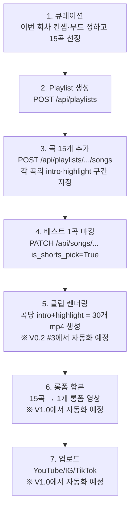

# 채널 콘셉트 — coolvibeply

> 20-30대 Pop / R&B / Jazz 플레이리스트 큐레이션 채널.

## 1. 타겟 페르소나

- **연령**: 20대 중반 ~ 30대 중반
- **상황**:
    - 출퇴근, 늦은 밤 작업, 카페·홈오피스에서 BGM이 필요한 직장인·프리랜서
    - SNS에서 "감성 플레이리스트"를 즐겨 듣고 다음 좋은 트랙을 찾는 사람
- **언어**: 한국 거주자, 영어 가사도 즐기지만 한국어 번역 자막이 있으면 더 깊이 듣게 됨
- **플랫폼 동선**: 인스타·틱톡 릴스에서 곡 발견 → 유튜브 풀버전·플레이리스트로 이동

## 2. 장르·무드

- **Pop**: indie pop, bedroom pop, dream pop
- **R&B**: neo soul, alt R&B, late-night R&B
- **Jazz**: contemporary jazz, jazz fusion, vocal jazz
- **무드 키워드**: 새벽, 비, 도시 야경, 카페, 홈오피스, 잠 못 드는 밤, 휴일 아침

## 3. 1회 작업 단위 = 한 영상 회차

채널 운영자는 **한 회차마다 15곡**을 선정해 다음 산출물을 모두 만든다.

### 산출물 3종

| 플랫폼 | 형식 | 수량 | 역할 |
|---|---|---|---|
| YouTube (롱폼) | 15곡 플레이리스트 영상 (~50-70분) | **1개** | 메인 콘텐츠. 검색·추천으로 깊이 듣는 시청자 유입 |
| Instagram / TikTok | 곡별 intro + highlight 클립 (각 30~60초, 9:16 듀얼 자막) | **곡당 2개** = **30개** | 홍보. 새 청취자 발굴 채널 |
| YouTube Shorts | 15곡 중 베스트 1곡의 highlight | **1개** | 알고리즘 후킹. 본 채널 구독 유도 |

## 4. 곡당 두 구간 (intro · highlight)

곡 한 개에서 **두 구간**을 따서 별도 클립으로 만든다.

- **intro**: 곡의 도입부 (보컬·코드·드럼 등장 전후), 곡의 분위기를 빠르게 전달
- **highlight**: 후렴구 또는 가장 임팩트 있는 30~60초

각 클립은 **9:16 1080×1920** + **영문 가사 + 한국어 번역** 듀얼 자막으로 합성.

## 5. shorts_pick — 15곡 중 1곡

15곡 모두에서 클립을 만들지만, **YouTube Shorts에는 단 한 곡만** 올린다. 이 곡의 highlight가 알고리즘 후킹 역할을 한다.

- 데이터 모델에서 `Song.is_shorts_pick = True`로 표시
- 한 플레이리스트 안에서 단 한 곡만 True (다른 곡 마킹 시 자동 해제)
- 선정 기준 (편집 가이드, 정량 지표 아님):
    - 첫 5초에 후킹이 강한 곡
    - 한국어 번역이 짧고 임팩트 있는 곡
    - 시청자가 "이 노래 뭐예요?" 댓글을 부를 만한 곡

## 6. 워크플로우 (1회차 작업 흐름)

## 7. 편집 가이드 (자막 톤앤매너)

- 영문: 상단(70%), 반투명 흰색, 약한 그림자, **부속 정보**처럼 작게
- 한글: 하단(82%), 불투명 흰색 + 검정 외곽선, **주인공처럼** 크고 굵게
- 번역 톤: "원문 직역" 아닌 **쇼츠 자막 톤** — 짧고 감성적, 입에 붙는 느낌. (Gemini 프롬프트에 "짧고 임팩트 있게" 명시)

## 8. 비목표

- ❌ 음원 라이선싱 자동화 — 운영자가 합법 소스(공식 채널 영상 등) 사용 책임
- ❌ 다국어 (영·한 외) — 한국 시청자 우선, 다국어는 V2 이후
- ❌ AI 음원 생성 — 큐레이션 채널이라 기존 곡을 발굴·소개하는 것이 핵심

## 9. 성공 지표 (운영자 판단용, 시스템 지표 아님)

- 신규 시청자 발견 채널 — 인스타·틱톡 클립의 평균 도달
- 본 채널 유입률 — Shorts → 롱폼·구독 전환
- 시청자 댓글의 "이 곡 정보" 비율 — 큐레이션 가치의 척도
